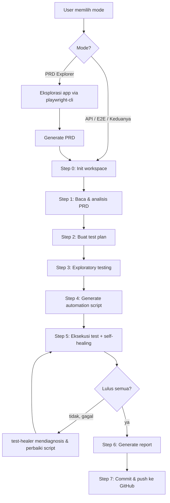

# QA Automation Framework — OrangeHRM (Playwright + TypeScript)

Framework otomasi pengujian E2E dan API untuk aplikasi OrangeHRM Open Source demo. Seluruh siklus pengujian dikerjakan oleh AI agent mengikuti workflow terstruktur: eksplorasi PRD, test plan, pembuatan script, eksekusi dengan self-healing, hingga reporting.

## Tools yang Digunakan

| Tool / Komponen | Fungsi |
|------|--------|
| Playwright | Framework test E2E & API |
| TypeScript | Bahasa pemrograman test |
| Node.js | Runtime eksekusi |
| Page Object Model (POM) | Pola desain untuk maintainability UI test |
| Git / GitHub | Version control & repository |
| AI Coding Agent (Cline) | Orkestrator yang menjalankan seluruh workflow pengujian |
| Skill `playwright-cli` | Otomasi browser untuk eksplorasi manual (PRD Explorer) via CLI Playwright |
| Agent `playwright-test-planner` | Menganalisis PRD dan menyusun test plan komprehensif |
| Agent `playwright-test-healer` | Mendiagnosis kegagalan test dan melakukan self-healing pada script |
| GitHub MCP Server | Integrasi commit/push langsung dari agent ke repository |

## Struktur Proyek

```
.
├── PRD/                      # Product Requirements Document per fitur
├── doc/Test-Plan/            # Test plan per fitur
├── pages/                    # Page Object Model classes
│   └── <NN>-<feature>/
├── tests/
│   ├── e2e/<NN>-<feature>/   # Skenario UI per fitur
│   ├── api/<NN>-<feature>/   # Skenario API per fitur
│   ├── fixtures/             # Custom fixtures
│   ├── helpers/              # Utility functions
│   └── global-setup/         # Login via UI + session storage state
├── scripts/exploratory/      # Script eksplorasi manual
├── test-results/             # Report & evidence hasil eksekusi
├── bugs/                     # Defect log yang ditemukan saat testing
├── playwright.config.ts      # Konfigurasi Playwright
└── specs/README.md           # Dokumentasi singkat
```

Penamaan folder fitur menggunakan format `<NN>-<feature>` (contoh: `01-login`, `12-buzz`) agar konsisten di semua lokasi.

## Workflow Agentic AI



Mode yang tersedia:

- **E2E** — uji alur UI dari sudut pandang pengguna
- **API** — uji endpoint langsung tanpa UI
- **Keduanya** — jalankan API lalu E2E untuk fitur yang sama
- **Regression** — jalankan seluruh suite yang ada + auto-heal kegagalan
- **PRD Explorer** — eksplorasi area aplikasi dan hasilkan PRD

## Cara Menulis Prompt Berdasarkan Workflow

Prompt cukup menyebutkan mode dan fitur target. Contoh:

```
Jalankan workflow API dan E2E untuk fitur Buzz (12).
Gunakan PRD/prd-12-buzz.md sebagai acuan.
Ikuti prompts/api.md sampai selesai, lanjutkan prompts/e2e.md,
lalu commit sesuai template di prompts/git-commit.md.
```

Contoh prompt regression:

```
Jalankan regression penuh seluruh suite (E2E + API),
heal semua kegagalan tanpa membuat test baru,
dan buat report regression timestamped.
```

## Instalasi

Prasyarat: Node.js 18+ dan Git sudah terpasang.

```bash
git clone https://github.com/Adfrach/Automation-Testing-With-Playwright.git
cd Automation-Testing-With-Playwright
npm install
npx playwright install chromium
```

Tidak perlu file `.env` — semua variabel (`BASE_URL`, `TEST_USERNAME`, `TEST_PASSWORD`) memiliki default ke OrangeHRM OS demo. Buat `.env.development` hanya jika ingin override target atau kredensial.

## Menjalankan Test

Seluruh suite (E2E + API):

```bash
npx playwright test
```

Per fitur (contoh fitur Buzz):

```bash
npx playwright test tests/e2e/12-Buzz
npx playwright test tests/api/12-Buzz
```

Per tag:

```bash
npx playwright test --grep "@smoke"
```

Melihat report HTML:

```bash
npx playwright show-report
```

## Contoh Hasil Test Report

Report disimpan di `test-results/e2e/<NN>-<feature>/` dan `test-results/api/<NN>-<feature>/`. Contoh ringkasan:

```
# Test Report - Buzz - E2E

Ringkasan Eksekusi
Total Test : 3
Passed     : 3
Failed     : 0

Hasil Per Test Case
TC-01  Buka halaman Buzz            PASS
TC-02  Post teks muncul di feed     PASS
TC-03  Filter Most Liked Posts      PASS

Healing Log
1. TC-02: tombol "Post" strict-mode violation -> locator exact:true
```

## Contoh Reporting Bug

Bug ditemukan saat testing diarsipkan di `bugs/api/<NN>-<feature>.md` dengan format:

```
BUG-LEAVE-001
Severity : Critical
Title    : Endpoint leave/requests mengembalikan data cuti tanpa auth

Steps to Reproduce:
1. GET /api/v2/leave/requests tanpa cookie/session
2. Perhatikan response body

Expected: HTTP 401 Unauthorized
Actual  : HTTP 200 dengan seluruh data cuti karyawan

Status: Open
```

## Catatan

- Session login dibuat otomatis oleh global-setup setiap run dan disimpan di `playwright-artifacts/auth-state.json` (tidak di-commit).
- Report dan evidence tidak di-commit; di-generate ulang setiap eksekusi.
- Regression report tersimpan sebagai `test-results/regression/regression-test-report-<timestamp>.md`.